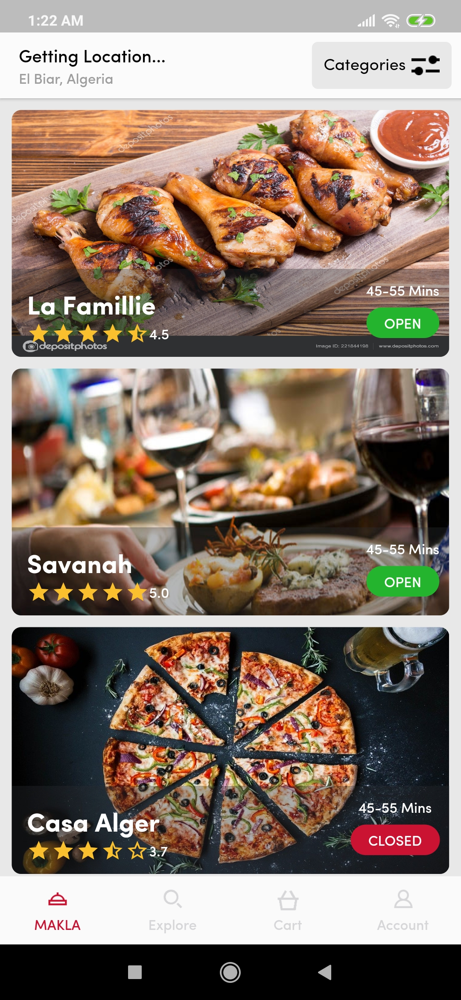

# Yassir Food App Clone
This app is a clone of the original [YASSIR Food](https://play.google.com/store/apps/details?id=com.yatechnologies.yassirfoodclient&hl=en) app

# Show me some ❤️ and star the repo to support the project.

# Note
- The data used within the app is static & generated one
- This repository is still under development and I will continue to add more features to it.

# Screenshots

<p align="center">



<video src="screenshots/demo.mp4" width="300" height="600" controls preload></video>
</p>

# Getting started

1. [Setup Flutter](https://flutter.dev/docs/get-started/install)

2. Clone the repo

    ```
    $ git clone https://github.com/lagripe/Yassir-Food-Clone
    $ cd Yassir-Food-Clone/
    ```
3. Run
        `$ flutter run`

